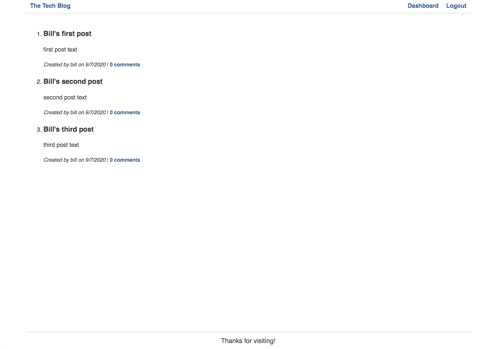

# Tech Blog
* A CMS-style tech blog site

## Description
* This is a tech blog site where users can view, post and comment on blog posts.  Unregistered users can view only but logged in users can post and comment.  Users can view their own posts in the dashboard.  Here they can also edit and delete them.

## Links
* [Heroku Deployed Link](https://floating-lake-51682.herokuapp.com/)
* [GitHub Repo Link](https://github.com/taylornyquist/tech-blog)





## Table of Contents

* [Usage](#usage)
* [Installation](#installation)
* [Run](#run)
* [Technology](#technology)
* [Questions](#questions)
* [Contribution](#contribution)

## Usage
Go to GitHub to clone the repo on your machine.

## Installation
To install necessary dependencies, run the following command:
```
npm init
```
```
npm install
```
This should install the following dependencies into package.json:
```
 "dependencies": {
    "bcrypt": "^5.0.0",
    "connect-session-sequelize": "^7.0.1",
    "dotenv": "^8.2.0",
    "express": "^4.17.1",
    "express-handlebars": "^5.1.0",
    "express-session": "^1.17.1",
    "mysql2": "^2.1.0",
    "sequelize": "^6.3.5"
  }
```

## Run
To run the application as a local host, run:
```
mysql -u root -p
```
```
source db/schema.sql
```
```
quit
```
```
npm start
```

## Technology
This application used the following technology:

* JavaScript
* Node.js
* Express.js
* Dotenv
* Sequelize
* MySQL 2
* Bcrypt
* Express-Session
* Express-Handlebars


## Questions
If you have any questions about the repo, open an issue or contact me directly at tnyquist@gmail.com.  You can find more of my work at [taylornyquist](https://github.com/taylornyquist).


## Contribution
* Taylor Nyquist